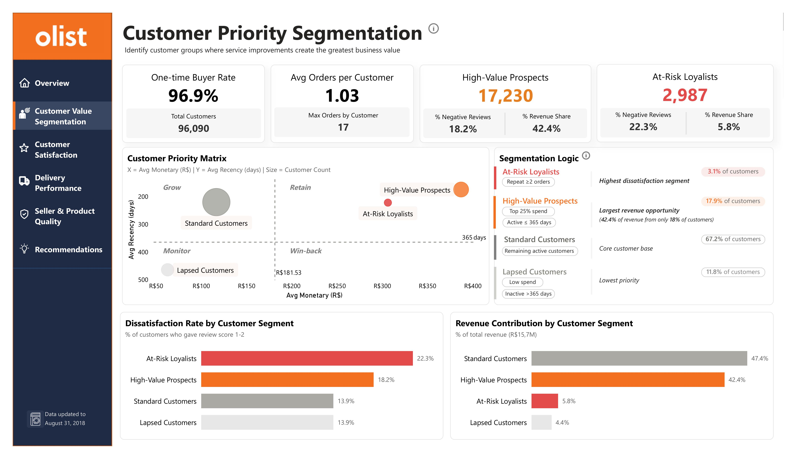
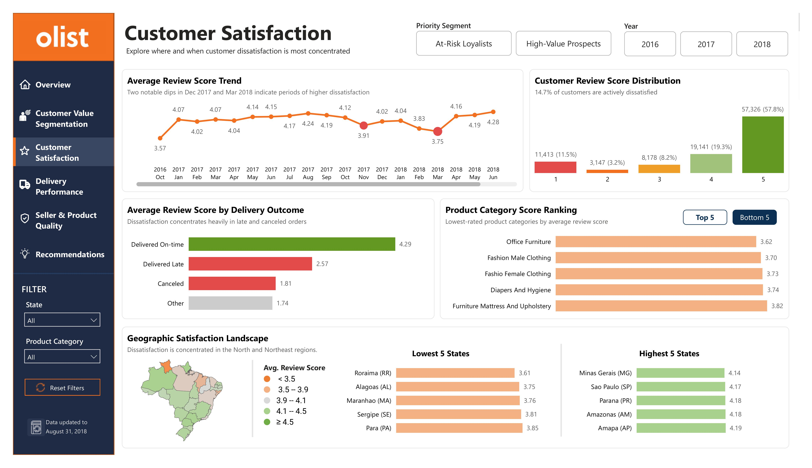
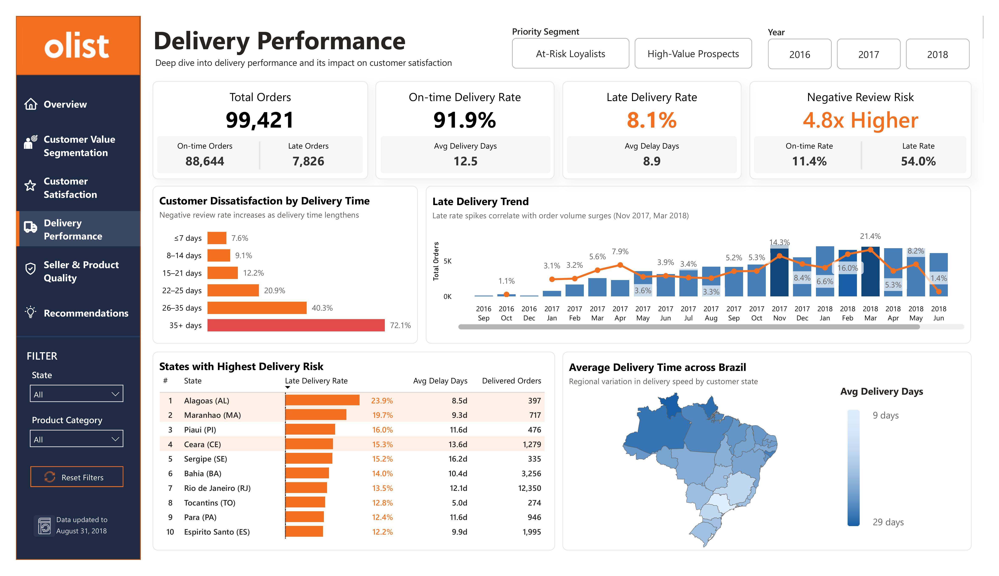
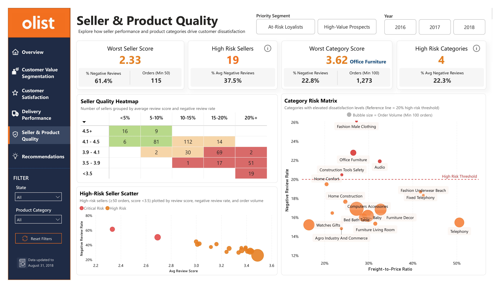
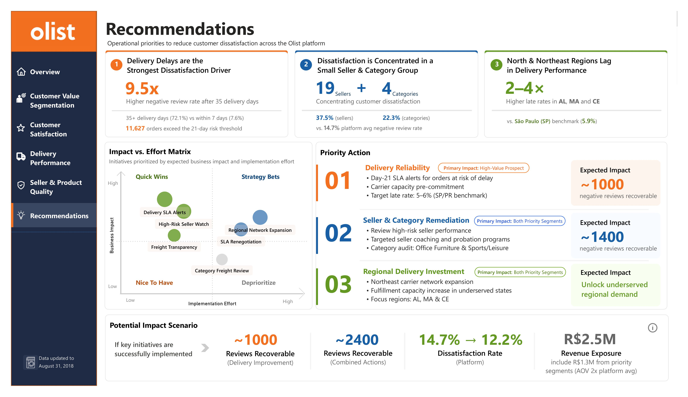

# Olist Customer Dissatisfaction Analysis

## Project Overview

A 6-page Power BI executive dashboard analyzing customer dissatisfaction on the Olist platform — identifying the operational drivers of negative customer experiences and applying customer value segmentation to prioritize improvement initiatives for the customer groups with the greatest business impact.

---

## Business Problem

14.7% of orders on Olist receive a negative review (1–2★), yet the underlying drivers of dissatisfaction are not clearly understood. At the same time, not all dissatisfied customers have the same business value. Without identifying both the operational drivers of dissatisfaction and the customer segments where poor experiences create the greatest business impact, improvement initiatives risk being unfocused and low-impact.

---

## Business Questions
- Which customer segments should Olist prioritize for customer experience improvement?
- Which operational factors drive customer dissatisfaction?
- How does delivery performance impact negative customer reviews?
- How do seller performance and product quality influence customer satisfaction?
- Which sellers, product categories, and regions contribute most to negative customer experiences?
- Which initiatives should Olist prioritize to improve customer experience?

---

## Dataset

**Source:** Brazilian E-Commerce Public Dataset by Olist — real, anonymized transaction data from a Brazilian multi-seller marketplace.

The analysis integrates data from 8 relational tables, including orders, order items, payments, reviews, customers, sellers, products, and category translations.

- **Scale:** 99k+ orders and 96k+ unique customers
- **Coverage:** Nationwide transactions across Brazil
- **Analysis period:** Sep 2016 – Aug 2018 (Sep–Oct 2018 excluded due to incomplete data)

---

## Tools Used

- Power BI
- Power Query
- DAX

---

## Key Metrics

- Negative Review Rate (1–2★ Reviews)
- Average Review Score
- Repeat Purchase Rate
- Late Delivery Rate
- Total Orders
- Total Revenue

---

## Key Findings

- **Delivery delays are the strongest driver of customer dissatisfaction** — orders delivered after 35 days show a 9.5× higher negative review rate than those delivered within 7 days, with over 11,600 orders exceeding the 21-day delivery risk threshold.

- **Customer dissatisfaction is concentrated among a relatively small group of sellers and product categories.** Customer value segmentation further identifies high-priority customer segments that account for 48.2% of platform revenue while representing only 21% of customers. These segments exhibit distinct dissatisfaction patterns that require differentiated remediation strategies.

- **North and Northeast regions consistently lag behind São Paulo (SP)**, the platform's delivery-performance benchmark (5.9% late delivery rate), in both delivery performance and customer satisfaction, indicating structural logistics gaps.

---

## Business Recommendations

1. **Strengthen delivery reliability** through proactive SLA monitoring, early-warning mechanisms, and carrier capacity planning during peak periods.

2. **Improve seller and product quality management** through performance monitoring while tailoring remediation strategies for high-priority customer segments.

3. **Invest in logistics capabilities across the North and Northeast regions** through expanded carrier partnerships and enhanced fulfillment capacity.
---

## Dashboard Preview

### Executive Overview

### Customer Priority Segmentation

### Customer Satisfaction

### Delivery Performance

### Seller & Product Quality

### Recommendations

---

## Technical Highlights

- **Built a multi-fact dimensional data analytical model** to support cross-functional analysis across orders, reviews, sellers, products, payments, and logistics data.

- **Developed custom DAX measures** to support customer satisfaction analysis, customer value segmentation, delivery performance monitoring, and seller/category risk identification.

- **Developed a rule-based customer value segmentation framework** adapted from RFM principles and validated against K-Means clustering to prioritize high-impact customer groups while maintaining business interpretability.

- **Implemented risk-tiering logic** with minimum-volume thresholds to reduce false positives when identifying high-risk sellers (≥50 orders) and product categories (≥100 orders).

- **Designed benchmark-based regional performance analysis** comparing underperforming states (e.g., AL, MA, CE) against São Paulo (SP), the platform's delivery-performance benchmark with a 5.9% late-delivery rate.

- **Applied an Impact-vs-Effort prioritization framework** to translate analytical findings into actionable business recommendations.

---

## Project Files

- Interactive Dashboard – Explore the live Power BI report (https://lnkd.in/gea766am)
- Olist_Report.pdf – Dashboard report for quick viewing.
- Power BI source file (.pbix) available upon request.
