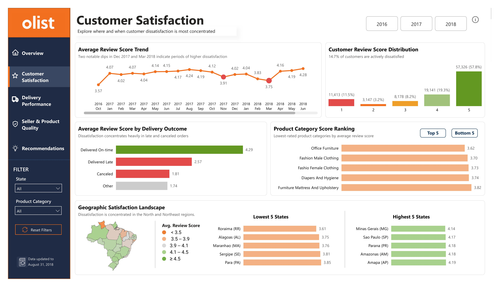
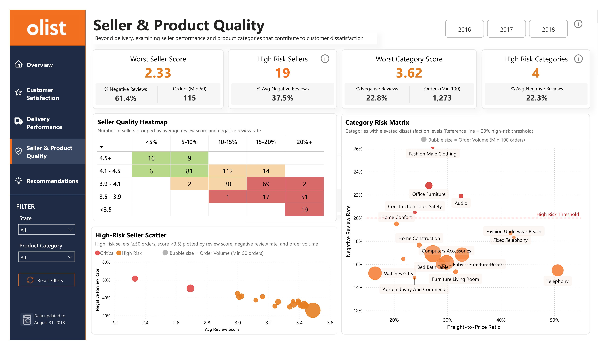

# Customer Dissatisfaction Analysis in Olist E-commerce

## Project Overview

A 5-page Power BI executive dashboard analyzing customer dissatisfaction on the Olist platform — built on order, delivery, seller, and review-level data to identify which operational factors most strongly associated with negative customer experiences.

---

## Business Problem

14.7% of orders on Olist receive a negative review (1–2★), yet the underlying drivers of dissatisfaction are not clearly understood. Without isolating which factors — delivery delays, specific sellers/categories, or regional logistics gaps — contribute most, improvement efforts risk being unfocused and low-impact.

---

## Business Questions

- What factors drive customer dissatisfaction?
- How does delivery performance impact negative customer reviews?
- How do seller performance and product quality influence customer satisfaction?
- Which operational issues contribute most to customer dissatisfaction?
- What actions should Olist prioritize to improve customer experience?

---

## Dataset

**Source:** Brazilian E-Commerce Public Dataset by Olist — real, anonymized transaction data from a Brazilian multi-seller marketplace.

The analysis integrates data from 8 relational tables, including orders, order items, payments, reviews, customers, sellers, products, and category translations.

- **Scale:** 99k+ orders and 96k+ unique customers
- **Coverage:** Nationwide transactions across Brazil
- **Analysis period:** Sep 2016 – Aug 2018 (Sep–Oct 2018 excluded due to incomplete data)

---

## Tools Used

- Power BI
- Power Query
- DAX

---

## Key Metrics

- Negative Review Rate (1–2★ Reviews)
- Average Review Score
- Late Delivery Rate
- Average Delivery Days
- Freight-to-Price Ratio
- Total Orders

---

## Key Findings

- Delivery delays are the strongest driver of customer dissatisfaction — orders delivered after 35 days show approximately 9.5× higher negative review rates than orders delivered within 7 days.
- Customer dissatisfaction is concentrated among a relatively small group of sellers and product categories, indicating that issues are not evenly distributed across the platform.
- North and Northeast regions consistently lag behind São Paulo (SP), the platform's delivery-performance benchmark, in both delivery performance and customer satisfaction.

---

## Business Recommendations

1. Strengthen delivery SLA management through early-warning mechanisms and proactive carrier capacity planning during peak periods.

2. Manage high-risk sellers and product categories through performance monitoring, service quality improvement initiatives, and greater transparency in shipping costs.

3. Invest in logistics capabilities in the North and Northeast region through expanded carrier partnerships and enhanced fulfillment capacity.

---

## Dashboard Preview

### Executive Overview

### Customer Satisfaction

### Delivery Performance

### Seller & Product Quality

### Recommendations

---

## Technical Highlights

- Built a star-schema data model integrating 8 relational tables across orders, order items, payments, reviews, customers, sellers, products, and category translations.

- Developed custom DAX measures for Negative Review Rate, Late Delivery Rate, Freight-to-Price Ratio, and seller/category risk scoring.

- Implemented risk-tiering logic with minimum-volume thresholds to reduce false positives when identifying high-risk sellers (≥50 orders) and product categories (≥100 orders).

- Designed benchmark-based regional performance analysis comparing underperforming states (e.g., AL, MA, CE) against São Paulo (SP), the platform's delivery-performance benchmark with a 5.9% late-delivery rate.

- Applied an Impact-vs-Effort prioritization framework to translate analytical findings into actionable business recommendations.

---

## Project Files

- Olist_Report.pdf – Dashboard report for quick viewing.
- Power BI source file (.pbix) available upon request.
