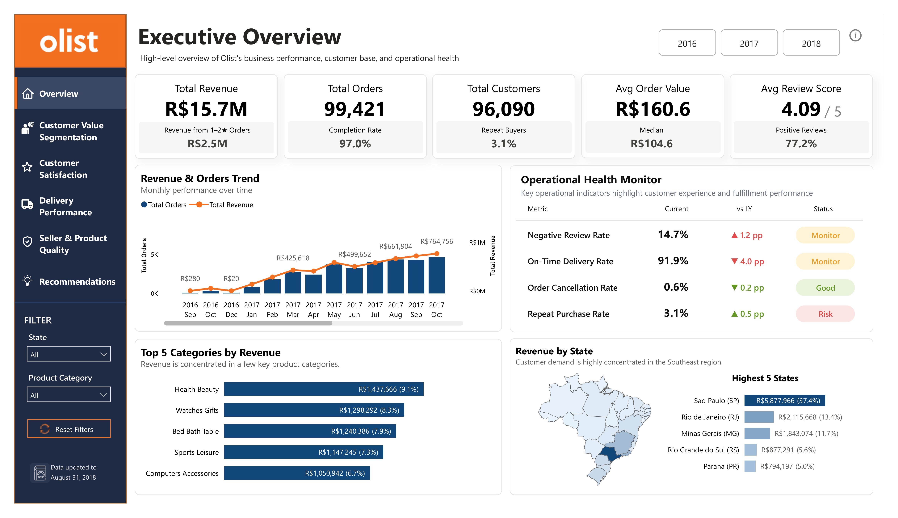
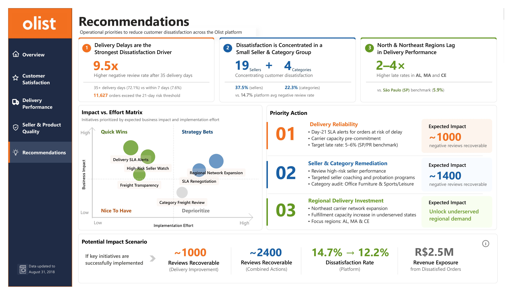

# Customer Dissatisfaction Analysis in Olist E-commerce

## Project Overview

This project analyzes customer dissatisfaction on the Olist e-commerce platform using Power BI.

The objective is to identify the key drivers of negative customer experiences and provide actionable business recommendations to improve customer satisfaction.

---

## Business Questions

- What factors drive customer dissatisfaction?
- How does delivery performance impact negative customer reviews?
- How do seller performance and product quality influence customer satisfaction?
- Which operational issues contribute most to customer dissatisfaction?
- What actions should Olist prioritize to improve customer experience?

---

## Dataset

Source: Brazilian E-Commerce Public Dataset by Olist

- Orders: 99k+
- Customers: 96k+
- Period: Sep 2016 – Aug 2018

---

## Tools Used

- Power BI
- Power Query
- DAX

---

## Key Metrics

- Negative Review Rate (1–2★ Reviews)
- Average Review Score
- Late Delivery Rate
- Average Delivery Days
- Freight-to-Price Ratio
- Total Orders

---

## Key Findings

- Delivery delays are the strongest driver of customer dissatisfaction, with negative review rates rising significantly once delivery times exceed 25 days.
- Customer dissatisfaction is concentrated among a relatively small group of sellers and product categories.
- North and Northeast regions consistently show poorer delivery performance and higher dissatisfaction rates compared to benchmark states such as São Paulo (SP) and Paraná (PR).

---

## Business Recommendations

1. Strengthen delivery SLA management through early-warning mechanisms and proactive carrier capacity planning during peak periods.

2. Manage high-risk sellers and product categories through performance monitoring, service quality improvement initiatives, and greater transparency in shipping costs.

3. Invest in logistics capabilities in the North and Northeast region through expanded carrier partnerships and enhanced fulfillment capacity.

---

## Dashboard Preview

### Executive Overview

### Delivery Performance

### Seller Analysis

### Category Analysis

### Recommendations

---

## Files

- Olist_Customer_Dissatisfaction.pbix
- Olist_Report.pdf
